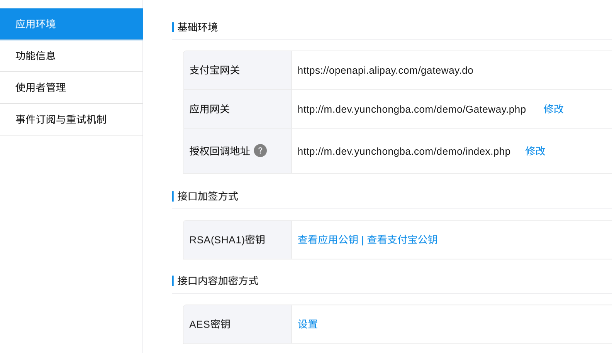

# 资料参考
[集成接入 PHP demo](https://doc.open.alipay.com/docs/doc.htm?spm=a219a.7629140.0.0.C0h23a&treeId=197&articleId=105240&docType=1)

# 集成接入php demo　目录
```
.
├── AlipaySign.php
├── aop
│   ├── AlipayMobilePublicMultiMediaClient.php
│   ├── AlipayMobilePublicMultiMediaExecute.php
│   ├── AopClient.php
│   ├── request
│   │   ├── AirCardConfirmWithPolicyTestTestRequest.php
│   │   └── ... // 各种服务请求
│   ├── SignData.php
│   └── test
│       └── TestImage.php
├── AopSdk.php
├── config.php
├── function.inc.php
├── Gateway.php
├── HttpRequst.php
├── img
│   ├── alipay.gif
│   └── new-btn-fixed.png
├── index.php
├── key
│   ├── alipay_rsa_public_key.pem
│   ├── rsa_private_key.pem
│   └── rsa_public_key.pem
├── log
│   └── log.txt
├── lotusphp_runtime    // 该demo 依赖的php库(阿里内部)
│   ├── Autoloader
|   |－　...
├── Message.php
├── PushMsg.php
├── test.php
├── UserInfo.php
└── 集成接入php demo.docx
```

# /config.php 配置
```
$config = array (
		'alipay_public_key_file' => dirname ( __FILE__ ) . "/key/alipay_rsa_public_key.pem",
		'merchant_private_key_file' => dirname ( __FILE__ ) . "/key/rsa_private_key.pem",
		'merchant_public_key_file' => dirname ( __FILE__ ) . "/key/rsa_public_key.pem",
		'charset' => "GBK",
		'gatewayUrl' => "https://openapi.alipay.com/gateway.do",
		'app_id' => "2015050800012345"
);
```
# Gateway.php
请将该文件配置到支付宝服务窗后台，验证网关处，这个文件主要负责接收和处理支付宝发过来的消息。

# Index.php
该文件可以配置到服务窗的菜单中，分别配置两种类型的菜单，跳转网页和自动登录，都把地址指向到该文件。一些功能使用可能会提示无权限。

# Wappay 文件夹
是wap支付的Demo


# 线上配置
**验证开发者网关** 输入开发者的公网网关入口，和开发者公钥（ 一行格式 ）


